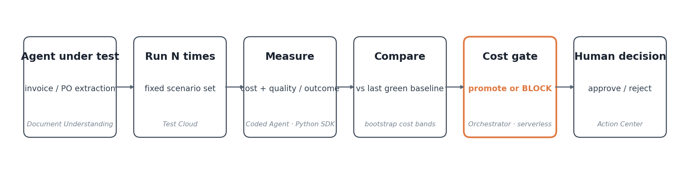

# CostGuard — an agentic cost & efficiency regression gate for AI agents

**UiPath AgentHack 2026 · Track 3 (UiPath Test Cloud)**

[](https://github.com/GHGuide/costguard/actions/workflows/ci.yml) · License: MIT · Agent type: **coded** (UiPath Python SDK) — two coded agents, plus a real external **LangChain** agent as an alternate patient · Built with **Claude Code** via UiPath for Coding Agents.


> **It passed every test you already have. It's still 7× more.** That's the gap CostGuard closes — a cost-regression gate, run and governed on UiPath.

---

## Project description

Enterprises now ship AI agents into production fast, but they have no way to catch when a change makes an agent **silently more expensive**. A "harmless" prompt tweak or model upgrade can multiply token spend while still passing a correctness test. Traditional QA tests *whether the agent is right* — never *what it costs to be right*.

**CostGuard adds a new, governed test type to UiPath Test Cloud: cost & efficiency regression testing.** Before a changed agent is promoted to production, CostGuard runs it many times against a fixed scenario set, measures **cost per successfully-completed business outcome** (e.g. cost per correctly-processed invoice — *not* cost per token), compares it statistically against the last approved baseline, and:

- **PASS** → promote,
- **FAIL** (cost regressed) → block,
- **NEEDS_REVIEW** (uncertain, or cheaper-but-worse) → route to a human in UiPath Action Center.

Because cost is paired with a quality score, a "cheaper but dumber" agent can never sneak through.

> **Why cost-per-*outcome*:** only UiPath knows the business-process boundary an agent serves, so CostGuard can price an agent in dollars-per-invoice instead of dollars-per-token — the attribution problem FinOps practitioners flagged as unsolved in 2026.

### The hero result (runs offline, today — `python3 -m costguard.cli`)
```
COST / SUCCESS        $0.0010   →   $0.0071     (7.27x)
quality delta                        +4.4% accuracy   (92.7% → 97.1%)
VERDICT: FAIL ⛔  — "+4.4% accuracy is not worth the 7.27x cost"  → promotion blocked
```
A candidate that *looks* better (higher accuracy, passes correctness tests) is **7× more expensive per correctly-processed invoice**. CostGuard catches it before it ships. *(These exact numbers reproduce from the command above.)*

### The same gate on REAL models, via UiPath (live, no external key)
Routing the agent-under-test through the **UiPath AI Trust Layer LLM Gateway** (`UiPathLLMGateway`) — real models, real token usage, governed by the platform:
```
baseline  gpt-4.1-mini · simple   →  $0.0001 / correct invoice   (100% accuracy)
candidate gpt-4o · verify         →  $0.0017 / correct invoice   (100% accuracy)
VERDICT: FAIL ⛔  — 13.1x cost for +0.0% accuracy → blocked
```
The expensive "upgrade" (bigger model + a verify pass) bought **zero** quality and **13× the cost**. CostGuard blocked it — on real UiPath-gateway models, not a simulation. Raw result: [`docs/live-uipath-result.json`](docs/live-uipath-result.json).

> **On the spread of ratios.** You'll see 7.27× (offline), 7.26× (the serverless job), 13.12× (gateway), 12.76× (LangChain), 15.63× (realistic corpus). That isn't cherry-picking — the exact multiple depends on which two models you compare. The *finding* is consistent across every run: a "smarter" candidate costs **7–16× more per correct outcome for ≤2% accuracy gain**, and the gate blocks it every time. The point is the gate, not any single number.


### Two agents: the gate, then a Cost Explainer (multi-agent)
When the gate blocks a change, a **second agent** root-causes *why* the cost moved — decomposing the ratio into model price, extra calls, and token volume — and writes it in plain language. It runs on the **same UiPath LLM Gateway**, so both agents are governed by the platform. Live output from the run above:

> *"The cost-per-processed-invoice rose 13.12x due to a 6.25x increase in model price, doubled model calls per invoice, and a slight 1.05x increase in token volume. Since accuracy did not improve, this cost increase is not justified."*

The attribution is deterministic and tested; the plain-language summary is the LLM's. So CostGuard doesn't just say *no* — it says *why*, and what to revert.

### The gate must not drift (regression suite)
The gate's verdicts are pinned by a **regression suite of 30 hand-labelled scenarios** ([`evals/scenarios.json`](evals/scenarios.json)) — clear cost regressions, clear wins, cheaper-but-dumber traps, and within-noise ties. Each label is the call a FinOps reviewer would make; the suite locks the gate against it, so a code change that silently flips a verdict fails CI:
```
30/30 scenarios match their expected verdict     PASS 8 · FAIL 13 · NEEDS_REVIEW 9
```
This is a **consistency guard, not a quality benchmark** — the scenarios are *designed* to have an obvious right answer, so 30/30 means "the gate still behaves as specified," not "the gate is 100% accurate in the wild." Run it: `python3 -m costguard.evals`.

### Measured on realistic invoices, live (not a mock)
To answer "but the agent-under-test is simulated" head-on: the gate also runs on a **realistic invoice corpus** ([`dataset_real.py`](costguard/dataset_real.py)) — 12 varied real-world layouts with label variants, `$`/`€`/`£`, thousands separators, OCR-style noise, multi-line items and VAT/discounts. On the **UiPath LLM Gateway**, with real models and real tokens, the field accuracy is genuinely *measured*:
```
baseline  gpt-4.1-mini · simple   →  98.3% field accuracy   $0.0001 / correct invoice
candidate gpt-4o · verify         →  100%  field accuracy   $0.0023 / correct invoice
VERDICT: FAIL ⛔  — 15.63× cost for +1.7% accuracy → blocked
```
The baseline's **98.3%** is the tell: it made a *real* extraction error on the messy inputs — this is an LLM reading real-style invoices, not a hardcoded result. Raw: [`docs/live-real-result.json`](docs/live-real-result.json). (`run_live_real.py`; the `text` here stands in for what Document Understanding emits for a scanned PDF.)

## Architecture



## How it works

```
 change to agent (prompt/model/tool)
        │
        ▼
 ┌──────────────── UiPath Orchestrator job  (Maestro process = the productization path) ───────┐
 │   Patient = invoice/PO extraction agent  ──run N times over a Test Cloud scenario set──┐    │
 │   (demo: a simulated / real-LangChain agent;  production: Document Understanding + Agent Builder)│ │
 │                                                                                        ▼    │
 │   CostGuard coded agent (Python SDK)                                                         │
 │     • LLM gateway wraps every call → owns token + $ accounting  (governed by AI Trust Layer)  │
 │     • cost-per-successful-outcome + bootstrap confidence interval                            │
 │     • statistical compare vs last green baseline → PASS / FAIL / NEEDS_REVIEW                │
 │     • registers result in Test Cloud (Test Manager API)                                      │
 │                                                                                        │    │
 │   FAIL → block promotion        NEEDS_REVIEW → UiPath Action Center (human decides) ◄──┘    │
 └─────────────────────────────────────────────────────────────────────────────────────────────┘
```

## UiPath components used
- **UiPath Test Cloud / Test Manager API** — cost regression registered as a first-class test result; the gate.
- **UiPath Maestro** — the promote/block/escalate decision contract is implemented in [`maestro_contract.py`](costguard/uipath/maestro_contract.py) (`decide_action`); deploying it as a Maestro process is the orchestration drop-in.
- **Coded Agent (Python SDK)** — the CostGuard engine in this repo, **packaged and run as an Orchestrator job**. Two agents: the **gate** (verdict) and a **Cost Explainer** that root-causes the cost move in plain language — both run on the UiPath LLM Gateway.
- **Agent Builder (low-code)** — the production drop-in for the patient invoice-extraction agent. *Today the patient is a deterministic simulation offline and a real **LangChain** agent on UiPath models live (below);* the gate treats any of them identically.
- **Document Understanding** — invoice/PO field extraction (the patient).
- **API Workflows** — refreshes the model-pricing table (tokens → $) from a live source at runtime (`refresh_pricing()` reads `COSTGUARD_PRICING_FILE`/`_JSON`; a pricing API Workflow writes it), so the gate always costs against current rates without a code change.
- **AI Trust Layer — LLM Gateway** — the agent-under-test runs on real models here (`UiPathLLMGateway`), so token usage and cost are governed by the platform with no external API key. (Token/$ accounting is owned by the gateway wrapper itself; the platform's OpenTelemetry traces are the production evidence layer, not wired into this demo.)
- **Action Center** — human-in-the-loop on FAIL / NEEDS_REVIEW.
- **External framework** — a real **LangChain** agent-under-test runs on UiPath models and is gated by CostGuard, governed by the platform (live: 12.76× cost, +0% accuracy → blocked; [`docs/live-langchain-result.json`](docs/live-langchain-result.json)). Proves CostGuard tests *any* framework — UiPath-native or third-party.

> **Status (honest).** *Live today on UiPath Automation Cloud:* both coded agents run on the **AI Trust Layer LLM Gateway** (real models — the 13.12× FAIL and the LangChain 12.76× run are committed raw JSON); the coded agent is packaged and runs as an Orchestrator job; and the gate's verdict is registered as a **real Test Cloud execution result** on test case CG:1 (result history shows `Failed`, linked to this repo) — reproducible in one command via [`costguard/uipath/register_result.py`](costguard/uipath/register_result.py). *Deterministic + offline:* the full engine, the 30-scenario regression suite, and 27 tests.

### What's real vs. what's simulated (so you can trust the numbers)
| Real | Simulated / illustrative |
|---|---|
| LLM calls, token counts, $ cost — through the **UiPath LLM Gateway** (and Anthropic/OpenAI adapters) | The invoice **documents** are generated text — a templated set plus a 12-invoice *realistic* corpus (varied layouts, $/€/£, OCR noise) — not scanned PDFs run through Document Understanding |
| Field extraction from **actual model output**, parsed + scored vs ground truth — **measured 98.3% baseline accuracy** on the realistic corpus, live | The **offline** demo path uses a deterministic mock gateway (so it runs with no key) — there, accuracy is set, not measured |
| The **Orchestrator serverless job**, its FAIL verdict, and the **Test Cloud result** on CG:1 | Maestro orchestration + Action Center HITL are **contracts in code**, not deployed processes (the sandbox doesn't provision them) |
| The **cost-per-outcome** math, bootstrap CIs, and the 7.27× / 13.12× ratios on those inputs | The 30-scenario suite is a **consistency guard**, not a wild-accuracy benchmark |

The honest one-liner: **the cost engine and the UiPath integration are real; the agent-under-test is a controlled stand-in** so the regression is reproducible on demand. Swap in your own agent + documents and the same gate runs unchanged.

## Setup / run the demo (no API key, no platform access needed)
Requires Python 3.10+ and nothing else.
```bash
python3 -m costguard.cli           # human-readable gate report (the hero demo)
python3 -m costguard.cli --json    # machine-readable report (what Test Cloud registers)
python3 -m costguard.dashboard     # the control tower: savings ledger + fleet + cost-per-outcome trend
python3 -m costguard.evals         # gate regression suite: 30 labelled scenarios, all must match
python3 tests/test_engine.py       # engine tests
python3 tests/test_evals.py        # gate verdicts must still match the 30 labelled scenarios
python3 tests/test_ledger.py       # ledger / savings-math tests
python3 tests/test_stress.py       # fuzz 150 random configs — invariants hold
```
### Run on REAL models via UiPath (no external key)
With a UiPath bearer token + URL in the env, the agent-under-test runs on the AI Trust Layer LLM Gateway:
```bash
export UIPATH_ACCESS_TOKEN=...   # see costguard.uipath.auth.get_token
export UIPATH_URL=https://staging.uipath.com/<org>/<tenant>
uv run --with uipath python -m costguard.uipath.run_live
```

### Run against external-provider LLMs
Set `ANTHROPIC_API_KEY` (or `OPENAI_API_KEY`) in `.env`, then:
```bash
python3 -m costguard.live --provider anthropic \
    --baseline claude-haiku-4-5 --candidate claude-sonnet-4-6 \
    --candidate-strategy verify --n 6 --repeats 3
```
Same engine and verdict logic — only the gateway changes, so real token usage and real extraction quality flow through unchanged. Provider adapters (`AnthropicGateway`, `OpenAIGateway`) return true token counts and retry transient errors.

To test your own two agent versions, edit `BASELINE` / `CANDIDATE` in `costguard/cli.py`, or import `run_config`, `summarize`, `decide` and feed your own agent (any object exposing the patient contract).

## Agent type
**Coded.** Two **coded agents** — the Python regression gate + a Cost Explainer — deployed via the UiPath Python SDK and run on the UiPath LLM Gateway. The agent-under-test is the invoice-extraction patient (a deterministic simulation offline; a real **LangChain** agent live). A low-code **Agent Builder** agent is the natural production patient, but it is *not* built for this submission — don't let the component list below imply otherwise.

## How Claude Code built this
This solution was built **with Claude Code** (Anthropic) through **UiPath for Coding Agents**.
- **What it did:** scaffolded the entire coded engine (gateway, pricing, statistics, verdict, runner, report, CLI), designed the cost-per-outcome metric and the three-valued gate, wrote the tests, and (in progress) drives the `uip` CLI to pack/deploy the coded agent and wire the Test Cloud / Maestro / Action Center integration.
- **Evidence:** see [`docs/claude-code-log.md`](docs/claude-code-log.md) for prompt/session excerpts and screenshots. *(maintained during the build)*

## Repository layout
```
costguard/        engine: gateway, pricing, dataset, patient, quality, runner, stats, verdict, report, cli
  explainer.py    second agent — root-causes a cost regression (model/calls/tokens) in plain language
  evals.py        meta-test harness — scores the gate against labelled scenarios
  uipath/         platform wiring: auth, LLM gateway, Test Manager, Action Center, live runners
evals/            scenarios.json — 30 labelled gate scenarios (the gate scores 100%)
tests/            engine, ledger, eval, uipath, and 150-config fuzz tests
BRIEF.md          problem, idea, why-it-wins, judging map, milestones
RULES.md          hackathon rules (reference)
PROGRESS.md       running build log
```
