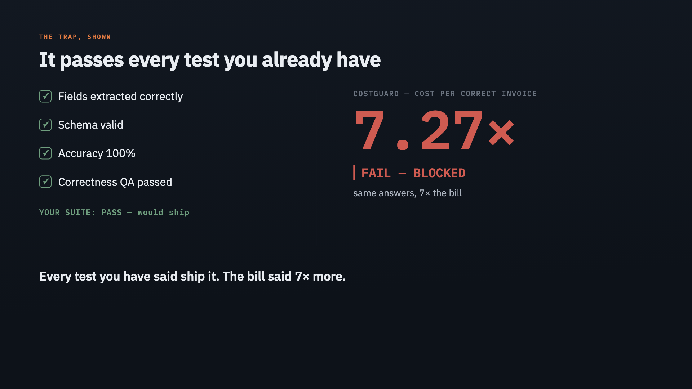

# Devpost project page — CostGuard

**Project title:** CostGuard — a cost & efficiency regression gate for AI agents

**Track:** Track 3 — UiPath Test Cloud

**Tagline:** Catch the 7× cost regression before it ships — not on next month's invoice.

---

> ### It passed every test you already have. It's still 7× more.
> A "smarter" agent version clears every correctness check you run — extraction correct, schema valid, accuracy 100%, QA passed. It would ship. CostGuard runs the *same* version and blocks it: **7.27× the cost per processed invoice, for the same answers.** *(image: `docs/greenred.gif` — green checks left, red BLOCK right)*

## The one idea

**Every QA suite tests whether your agent is *right*. None test what it *costs* to be right.** A prompt tweak or model "upgrade" can quietly multiply spend while passing every correctness test. CostGuard is the missing gate — and it prices an agent in **dollars per business outcome** (per *correctly-processed invoice*), **not per token**, because only the orchestration layer can see the outcome boundary. That single reframe — cost-per-outcome, paired with a quality score — is the whole moat: a "cheaper but dumber" agent can never sneak through either.

## What it does

CostGuard adds a new, governed test type to UiPath Test Cloud: **cost & efficiency regression testing for AI agents.** Before a changed agent (new prompt, model, or tool) is promoted, CostGuard runs it many times against a fixed scenario set, measures cost per successfully-completed outcome, compares it statistically (bootstrap confidence interval) against the last approved baseline, and returns a three-valued verdict:

- **PASS** → promote
- **FAIL** (cost regressed for no quality gain) → block the promotion
- **NEEDS_REVIEW** (within noise, or cheaper-but-worse) → escalate to a human in UiPath Action Center

When it blocks, a **second agent — the Cost Explainer** — root-causes *why* the cost moved (model price vs extra calls vs token volume) in plain language, on the same UiPath LLM Gateway. So CostGuard doesn't just say *no* — it says *why*, and what to revert.

## The business problem

Enterprises ship AI agents fast but have no way to catch when a change makes one **silently more expensive**. Model-API spend is now a board-level line item; runaway agent loops have burned five-figure bills; FinOps teams flag "attributing token spend to business outcomes" as unsolved. There's a correctness gate before production — there's no **cost gate**. CostGuard is that gate.

## Live proof (all real, all committed)

1. **A real unattended job on UiPath Automation Cloud.** Started from Orchestrator (serverless robot, ~10s): on a candidate that *improved* accuracy +4.5% but cost **7.26× more per correctly-processed invoice**, the job returned `verdict: FAIL · maestro_action: block · cost_ratio: 7.256` — a regression a single-run correctness test passes.
2. **The same gate on real models via the UiPath AI Trust Layer LLM Gateway** — a bigger model + a verify pass cost **13.12×** for **+0.0%** accuracy → blocked (`docs/live-uipath-result.json`).
3. **An external LangChain agent**, gated on UiPath models, **12.76×** → blocked (`docs/live-langchain-result.json`). Proves CostGuard tests *any* framework.
4. **A first-class Test Cloud result.** The verdict is registered as a real test execution result on test case **CG:1** in the CostGuard Test Manager project — result history shows **Failed**, linked to the repo (`costguard/uipath/register_result.py`).

## How do we know the gate is right?

A **regression suite of 30 hand-labelled scenarios** (`evals/scenarios.json`) pins the gate's verdicts — clear regressions, clear wins, cheaper-but-dumber traps, within-noise ties. All 30 must match their expected verdict in CI, so a change that silently flips a call fails the build. It's a **consistency guard, not a wild-accuracy benchmark** (the scenarios are designed to have an obvious right answer).

**What's real vs. simulated (so the numbers are trustworthy):** the LLM calls, token counts, $ cost, the Orchestrator serverless job, and the Test Cloud result are **real**; the invoice *documents* are synthetic and the offline path uses a deterministic mock so it runs keyless. Maestro, Action Center, Document Understanding, and a low-code Agent Builder agent are the *production* form — implemented as contracts/drop-ins, not deployed for this demo. The cost engine and UiPath integration are real — the agent-under-test is a controlled stand-in so the regression reproduces on demand.

## How it works

1. **Agent-under-test** ("patient"): an invoice/PO extraction agent. CostGuard treats it as a black box, so it tests UiPath Document Understanding agents *or* external LangChain/CrewAI agents identically.
2. **CostGuard coded agent** (UiPath Python SDK): runs the patient N times, owns token+cost accounting through the LLM gateway, computes cost-per-successful-outcome + bootstrap CI, compares candidate vs baseline → PASS / FAIL / NEEDS_REVIEW. A second **Cost Explainer** agent narrates the root cause.
3. **Orchestrator** runs it as an unattended serverless job; the verdict is the job output.
4. **Test Manager / Test Cloud**: the verdict is registered as a first-class test result (project "CostGuard", case CG:1).
5. **Action Center**: on FAIL/NEEDS_REVIEW a human owns the promote/quarantine decision.
6. A **savings ledger + control-tower dashboard** track money avoided (regressions blocked) and realized (optimizations adopted), as cost-per-business-outcome.

## UiPath components used

- **Coded Agents** (Python SDK) — two agents: the gate + the Cost Explainer, deployed + run on Orchestrator, both on the UiPath LLM Gateway
- **Orchestrator** — package feed, process, unattended/serverless job
- **Test Cloud / Test Manager** — the verdict as a first-class test result (CG:1 → Failed, live)
- **AI Trust Layer — LLM Gateway** — the agent-under-test runs on real models here, governed by the platform, no external key
- **Action Center** — human-in-the-loop on blocked/uncertain verdicts
- **Document Understanding** — the production source for the patient's document text (the demo feeds realistic invoice text directly; DU is the drop-in for scanned PDFs)
- **API Workflows** — refreshes the model-pricing table (tokens → $) from a live source at runtime
- **External frameworks** — a real LangChain agent supported (and gated live) as the agent-under-test
- Built, tested, packaged, deployed, and run end-to-end with **UiPath for Coding Agents (Claude Code + the `uip` CLI)**

## Agent type

**Coded** — two coded agents (the regression gate + the Cost Explainer, via the UiPath Python SDK), with a real external **LangChain** agent as an alternate patient, all governed by UiPath. (A low-code Agent Builder agent is the natural production patient but isn't built for this submission.)

## How we used a coding agent (bonus)

The entire solution — engine, statistics, gateway, the second (Explainer) agent, the 30-scenario eval, the savings ledger + dashboard, and the full UiPath integration — was designed, built, tested (**27 passing tests**), packaged, deployed, and run by **Claude Code** through **UiPath for Coding Agents**. Beyond codegen, it solved real platform-integration problems: granular Test Manager scopes, a Cloudflare-blocked token endpoint, the release-key job-start, the async LLM-gateway call, and registering the verdict as a Test Cloud execution result. See `docs/claude-code-log.md` and the git history.

## What's next

Cost-per-outcome trends as a continuous Maestro-orchestrated control tower; multi-agent fleet view; deeper Action Center forms once provisioned on the tenant.

## Try it

Repo: https://github.com/GHGuide/costguard (MIT). Offline, no keys:
`python3 -m costguard.cli` · `python3 -m costguard.evals` (regression suite) · `python3 -m costguard.dashboard`.
